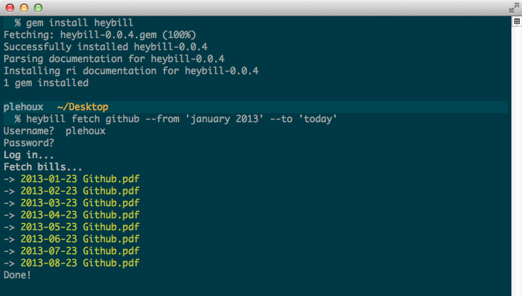

Heybill
=======

<p align="center">
  <a href="https://github.com/plehoux/Heybill">
    
  </a>
</p>

<p align="center">
  <i>Heybill</i> lets you automatically fetch bills/invoices from providers.<br><br>
  <a href="https://travis-ci.org/plehoux/Heybill"></a>
</p>

## Installation ##

```
gem install heybill
```

You also need PhantomJS (>= 1.8.1).

### Mac ###

* *Homebrew*: `brew install phantomjs`

### Linux ###

* Download the [32
bit](http://code.google.com/p/phantomjs/downloads/detail?name=phantomjs-1.8.1-linux-i686.tar.bz2&can=2&q=)
or [64
bit](http://code.google.com/p/phantomjs/downloads/detail?name=phantomjs-1.8.1-linux-x86_64.tar.bz2&can=2&q=)
binary.
* Extract the tarball and copy `bin/phantomjs` into your `PATH`

### Windows ###
* Download the [precompiled binary](http://phantomjs.org/download.html) for Windows

## Usage ##

```
heybill fetch [PROVIDER] --from 'june 2012' --to 'last month' --save-to ~/Documents/expenses
```

## List of supported providers ##

- Heroku
- Github

## Contribute ##

Heybill is a scraping application, it needs care, it needs you.

Fork. Add/Fix a provider. Pull request.

Provider's class are built around the [Capybara](https://github.com/jnicklas/capybara)/[Poltergeist](https://github.com/jonleighton/poltergeist) DSL + helper methods.

```ruby
module Heybill
  module Providers
    class Acme < Heybill::Provider
      ask :email
      ask :password

      log_in do
        # Do stuff to log in using Capybara dsl
        # @email and @password available from the 'ask' mehtods above
      end

      fetch_bills do
        # Find every html or PDF invoices included between self.from and self.to
        # Save each invoice with one of those two helpers:

        # If invoice an html document:
        visit('http://acme.com/invoices/1')
        save_page_as_bill("acme_1.pdf")

        # If invoice a PDF:
        save_pdf_as_bill("acme_1.pdf", 'http://acme.com/invoices/1.pdf')
      end
    end
  end
end
```

## License ##

The MIT License (MIT)

Copyright (c) 2013 Philippe-Antoine Lehoux

Permission is hereby granted, free of charge, to any person obtaining a copy of
this software and associated documentation files (the "Software"), to deal in
the Software without restriction, including without limitation the rights to
use, copy, modify, merge, publish, distribute, sublicense, and/or sell copies of
the Software, and to permit persons to whom the Software is furnished to do so,
subject to the following conditions:

The above copyright notice and this permission notice shall be included in all
copies or substantial portions of the Software.

THE SOFTWARE IS PROVIDED "AS IS", WITHOUT WARRANTY OF ANY KIND, EXPRESS OR
IMPLIED, INCLUDING BUT NOT LIMITED TO THE WARRANTIES OF MERCHANTABILITY, FITNESS
FOR A PARTICULAR PURPOSE AND NONINFRINGEMENT. IN NO EVENT SHALL THE AUTHORS OR
COPYRIGHT HOLDERS BE LIABLE FOR ANY CLAIM, DAMAGES OR OTHER LIABILITY, WHETHER
IN AN ACTION OF CONTRACT, TORT OR OTHERWISE, ARISING FROM, OUT OF OR IN
CONNECTION WITH THE SOFTWARE OR THE USE OR OTHER DEALINGS IN THE SOFTWARE.
